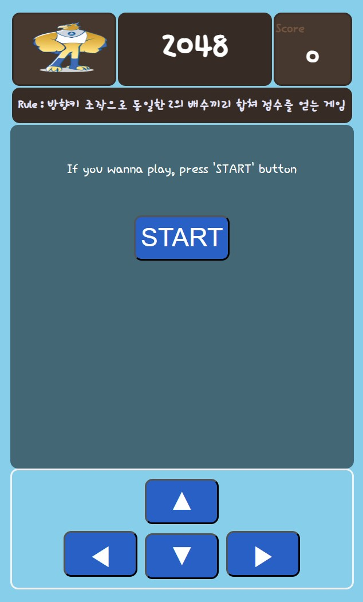
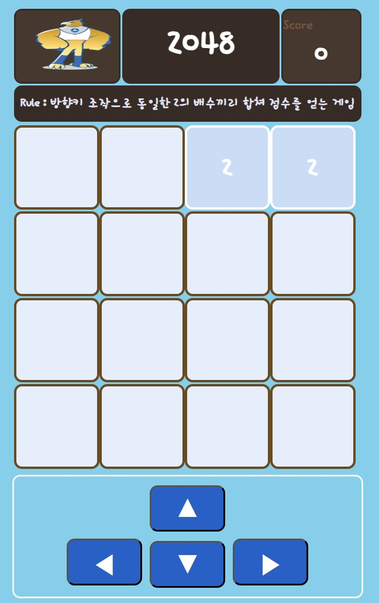
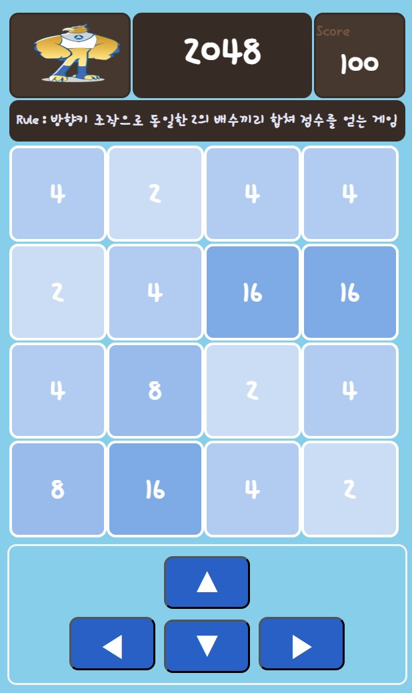
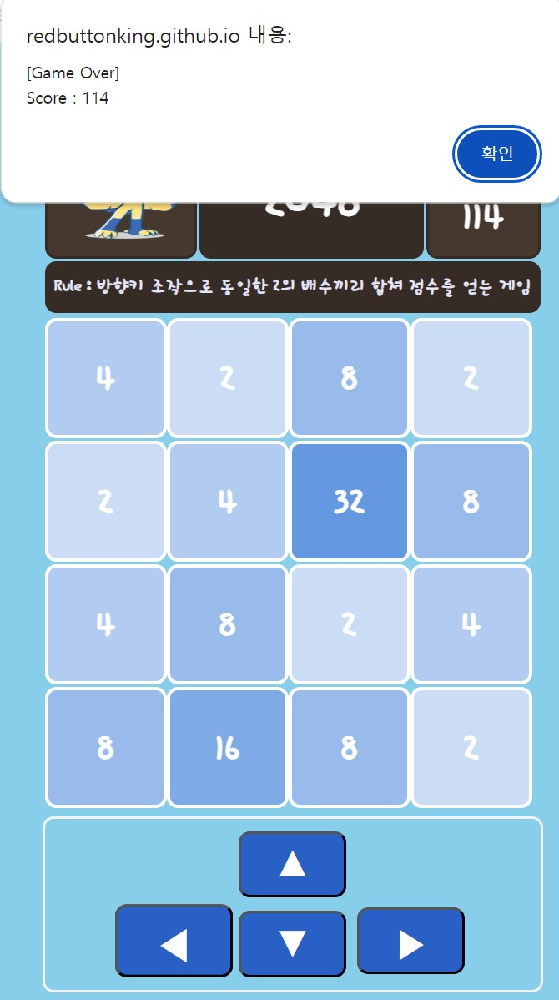
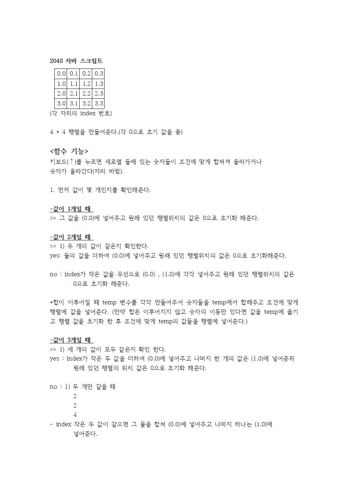
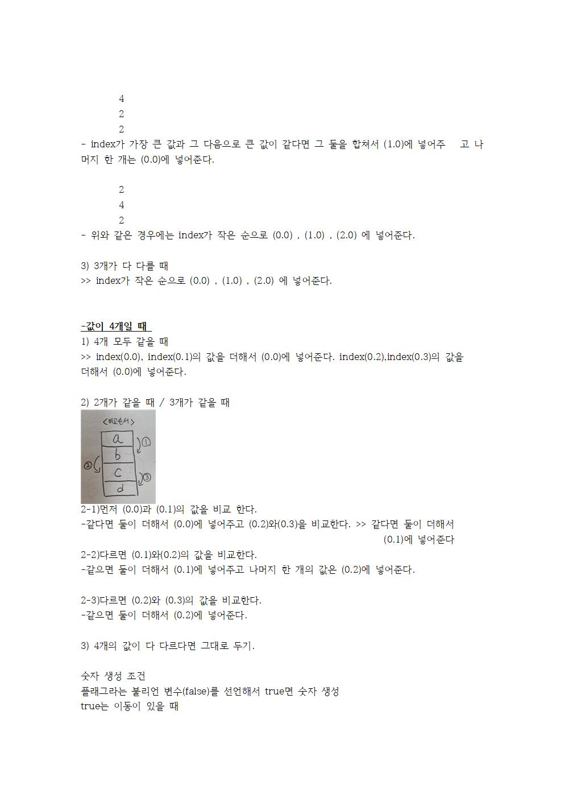

# web_last_project
<a href="https://redbuttonking.github.io/web_last_project/"> 프로젝트 link </a>

### 🔭Preview
|초기 화면|게임 시작|게임 중반|게임 오버|
|:--:|:--:|:--:|:--:|
|||||

# 1. 웹 프로그래밍 기말 프로젝트

> 맡은 역할 및 개발 부분

<팀장>
- 게임 기능 설계 및 구현 ( 새로운 블럭 생성,  블럭 합치기 및 블럭 위치 변경, 게임 오버 조건 ) 
- 코드 리뷰 및 코드 종합
- 보고서 작성 및 발표

# 2. 프로젝트 코드 설명 ( 맡은 부분 )

### 1) 게임 룰(위로 올라가는 조건)

  

 자세히 (이미지) 

|1|2|
|:--:|:--:|
||
||

# 3. 프로젝트를 마치며...
